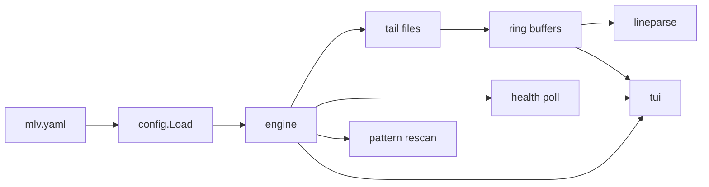

# Implementation specification

Authoritative implementation guide for the Go multi-log viewer (`mlv`). Where this document conflicts with older prose in other files, **this spec wins** until the docs are aligned.

**Source docs:** [01_initial_user_interface.md](01_initial_user_interface.md), [02_config_file_format.md](02_config_file_format.md), [README.md](../README.md), [mlv.yaml](../mlv.yaml).

---

## 1. Purpose and scope

### 1.1 Product summary

`mlv` is a terminal UI that:

- Loads a YAML config describing **services**, **log paths/patterns**, optional **health probes**, and optional **start/stop** commands.
- Shows a **sidebar tree** (services → optional capture folders → log files).
- Tails log files in the background and displays them in a **main pane** (single log, merged logs, or service detail).
- Polls health on an interval and shows **● / ○ / -** on service rows.

### 1.2 Version 1 goals

| In scope | Out of scope (v1) |
|----------|-------------------|
| Config load + validation | JSON log lines |
| Sidebar tree + cursor navigation | Filters on line variables |
| Tail fixed paths + `path_pattern` discovery | `start` / `stop` bound to keys |
| Ring buffer per file | Mixing service detail + live logs in one pane |
| `line_pattern` parse + timestamp merge | Configurable action buttons |
| Health: TCP port + `process_contains` | Web UI |
| Service detail pane + synthetic event log | Interactive KILL (display-only label for v1) |
| Keys: j/k, Enter, +, -, ?, q | Pressable KILL / other buttons |

### 1.3 Target platforms

- **Primary:** macOS, Linux (amd64/arm64).
- **Windows:** not required for v1; code should avoid blocking a future port (abstract process/port lookup).

---

## 2. Technology choices

| Area | Choice | Notes |
|------|--------|-------|
| Language | Go **1.22+** | Generics optional; `slog` for internal logging if needed |
| Module path | `github.com/jpmartin/multi_log_viewer` (or local module name until published) | Adjust to actual module path in `go.mod` |
| TUI | **[Bubble Tea](https://github.com/charmbracelet/bubbletea)** + **[lipgloss](https://github.com/charmbracelet/lipgloss)** | Fits Go; split model/update/view from core engine |
| YAML | `gopkg.in/yaml.v3` | |
| File watch | `github.com/fsnotify/fsnotify` with **1s poll fallback** if watch fails | |
| Process list | `github.com/shirou/gopsutil/v3/process` | Cross-platform command lines |
| Port / PID | Platform helpers (see §8) | |
| Tests | `go test ./...`; table-driven unit tests; optional golden tests for parser/sidebar | Replace Python `pytest` workflow in [development.md](development.md) when implementing |

---

## 3. Repository layout

```
.
├── cmd/
│   ├── mlv/          # main TUI binary
│   └── loggen/       # dev utility (README contract)
├── internal/
│   ├── config/       # load, validate, path resolution
│   ├── pattern/      # path_pattern → glob, captures, grouping
│   ├── lineparse/    # line_pattern compile + match
│   ├── tail/         # per-file tail, ring buffer, activity
│   ├── health/       # probes, PID resolution
│   ├── engine/       # orchestration, sidebar tree model, merge view
│   └── tui/          # bubbletea model, rendering only
├── scripts/
│   └── run-log-generators.sh   # starts loggen for sample layout
│   └── run-tests.sh            # runs the tests
├── mlv.yaml
└── docs/
```

**Dependency rule:** `internal/tui` imports `internal/engine` (and below). `internal/engine` must not import `internal/tui` so core stays reusable.

---

## 4. CLI

```
mlv [--config PATH]
```

| Flag | Default | Behavior |
|------|---------|----------|
| `--config` | `./mlv.yaml` | Path resolved relative to **process cwd** |

**Startup sequence:**

1. Resolve config path; if missing → exit **1** with message: `config not found: <path>`.
2. Load and validate config (§5); on error → exit **1** with clear message (no TUI).
3. Start engine (tails, health loop, pattern rescan).
4. Run TUI until quit.

**Environment:** require UTF-8 locale when possible; if `LANG` is `C` or unset, still run but document in README that Unicode bars may degrade.

---

## 5. Configuration (canonical schema)

Log discovery uses **`path`** (fixed file) or **`path_pattern`** (glob with optional `{capture}` segments). There is no `pattern` key.

### 5.1 Top-level fields

| Field | Type | Default |
|-------|------|---------|
| `project_root` | string | Directory containing the **config file** (not cwd unless config is `./mlv.yaml` in cwd) |
| `health_poll_seconds` | float | `2` |
| `pattern_rescan_seconds` | float | `5` |
| `ring_buffer_lines` | int | `2000` (min 100, max 100_000) |
| `services` | map | **required**, non-empty |

`project_root` is resolved relative to the config file’s directory, then made absolute.

### 5.2 Service fields

| Field | Required | Notes |
|-------|----------|-------|
| `logs` | yes | ≥1 entry |
| `health` | no | empty map = no probes |
| `start`, `stop` | no | Parsed and stored; **not executed** by TUI in v1 |
| `cwd` | no | Affects log path base and future start/stop cwd |

**Service base directory:** `project_root` or `project_root / cwd` if `cwd` set.

### 5.3 Log entry fields

Exactly one of `path` or `path_pattern`.

| Field | Applies to |
|-------|------------|
| `path` | fixed file |
| `path_pattern` | glob discovery |
| `label` | optional display template for pattern captures |
| `line_pattern` | optional; per entry |

**Path resolution:** `filepath.Join(serviceBase, path)` (cleaned). **Create parent directories** for fixed `path` if missing; create **empty file** if path does not exist.

**Pattern:** brace segments `{name}` → single-path-component glob `*`; build glob under service base; match only **regular files**; skip directories.

### 5.4 `start` / `stop` command form

- `string` → `/bin/sh -c <string>`
- `[]string` → exec argv, no shell

Stored for future CLI/engine API; v1 does not invoke.

### 5.5 Validation (fail fast)

Exit before TUI with messages including:

- `'services' must be a mapping`
- `service '<id>': logs required`
- `service '<id>': log entry requires path or path_pattern`
- `service '<id>': log entry cannot have both path and path_pattern`
- `service '<id>': invalid path_pattern: ...`
- `unknown line_pattern type: ...`

---

## 6. Line pattern language

### 6.1 Syntax

- Pattern is anchored at **start of line** (after optional UTF-8 BOM on first line only).
- Outside `{...}`, characters are **literal** (regex-escaped internally).
- `\{` and `\}` mean literal braces (not a field)
- Field: `{name}` or `{name:TYPE}` where `name` is `[a-zA-Z_][a-zA-Z0-9_]*`.
- Remainder of line after a successful prefix match is kept as unparsed tail (still stored and displayed).

### 6.2 Types

| TYPE | Parse rule |
|------|------------|
| `TIMESTAMP_ISO8601` | `YYYY-MM-DD HH:mm:ss[.sss] ±HH:MM` or `Z`; offset applied |
| `YYYY-MM-DD HH:mm:ss` | no TZ → **UTC** |
| `YYYY-MM-DD HH:mm:ss.SSS` | no TZ → **UTC** |
| `LOGLEVEL` | one of `DEBUG`, `INFO`, `WARN`, `ERROR` (case-sensitive) at current position |
| *(omitted)* | longest non-greedy run until next literal or `{` (whitespace allowed in value) |

### 6.3 Semantics

- Variable **`timestamp`** (any typed timestamp field stored under name `timestamp`) drives merge sort.
- No match → line stored with **no** variables; still shown in single-log view.
- **Merge eligibility:** a log file is merge-eligible iff its log entry defines `line_pattern` **and** at least one line in the ring buffer has parsed `timestamp` (config defines pattern; file may still have unparsed lines).

### 6.4 Merge algorithm

When main pane shows multiple **log** sources:

1. Collect ring-buffer lines from each open log with a parsed `timestamp`.
2. Sort by `timestamp` ascending; stable tie-break: service id, then file path, then line sequence in file.
3. Render: optional prefix `[service/file] ` (muted style) + raw line text.
4. Lines without timestamp in an opened log are appended **after** timestamped lines for that file, in file order (v1 simplification), or omitted from merge with a one-line status note — **chosen:** include at end of that file’s block when single-log; in merge, **exclude** non-timestamp lines from ordering but show them in a trailing section per file. **Simpler v1 rule:** merge only lines that have `timestamp`; non-timestamp lines never appear in merged view (status bar: `some lines lack timestamps` once when opening merge).

**Refined v1 rule (implement):** merged view includes **only** lines with parsed `timestamp`. Unparsed lines remain visible in single-log view only.

Press **`+`** on a log without `line_pattern` or with pattern but user never got a parsable line → refuse; status: `can only combine logs with parsed timestamps` until next key.

---

## 7. Tailing and ring buffer

### 7.1 Initial read

On attach:

1. If file size > ~2 MB, seek to approximate start: read backward for up to `ring_buffer_lines` lines (don't load whole file).
2. Else read entire file.
3. Fill ring buffer (newest retained); assign monotonic `seq` per line.

### 7.2 Live updates

- `fsnotify` on file and parent dir (recreate / truncate).
- On **truncate** or inode change: clear buffer, re-read from start (same initial-read rules).
- On append: read new bytes, split lines, push to ring; drop oldest past `ring_buffer_lines`.

### 7.3 Line parsing

Apply `line_pattern` on ingest; store `ParsedFields map[string]any` on each `Line` (`time.Time` for timestamps).

### 7.4 Activity indicator (per log file)

Unicode block levels (low → high): ` ` `▁` `▂` `▃` `▄` `▅` `▆` `▇` `█` (8 steps including empty).

- On each **new line** ingested for that file: set activity to maximum (`█`).
- Every **100ms** UI tick: decrement step toward empty (one step per tick while above empty).
- **Service row** activity (sidebar): max activity across all descendant log files (same character as logs).

---

## 8. Health and process tracking

### 8.1 Probes (every `health_poll_seconds`)

| Probe | Pass condition |
|-------|----------------|
| `port` (int) | TCP dial `127.0.0.1:port` succeeds within **500ms** |
| `port` (string `host:port`) | dial succeeds within 500ms |
| `process_contains` | ∃ process whose command line contains substring (**case-insensitive**) |

**Service up (●):** all configured probes pass. **○:** any configured probe fails. **-:** no probes configured.

### 8.2 PID resolution (service detail pane)

For display strings in [01_initial_user_interface.md](01_initial_user_interface.md):

1. If `port` configured and port is listening: resolve PID owning that port (macOS: `lsof -i :port -sTCP:LISTEN -t` first PID; Linux: read `/proc/net/tcp` + inode or `ss -lptn`).
2. If `process_contains` configured: among matching processes, prefer one that also owns the port when both configured.

**Running since:** earliest observation time this session where probes transitioned to pass; display `before <ISO8601 local>` if unknown at app start but currently up. If down: omit or show `stopped`.

**Activity rates (service pane):** lines/sec = lines ingested across **all** service logs in window / window seconds; show **1 min** and **10 min** windows.

### 8.3 Synthetic log (per service)

Ring buffer of **events** (max 500), newline-rendered at bottom of service detail:

| Event | When |
|-------|------|
| `running: ...` | On first poll where service already up at app start |
| `starts: ...` | Transition not-up → up |
| `SIGTERM sent` | Reserved; v1 only if we add programmatic kill later |
| `stops: ...` | Transition up → not down |

Format: `{timestamp} {serviceId} {message}` using local time with ms.

### 8.4 KILL button (v1)

- Show `[ KILL ]` line when PID known.
- **Not focusable / not clickable in v1** (per UI doc “won't have a way to actually press the buttons”).
- Do not send signals in v1.

---

## 9. Pattern rescan

Every `pattern_rescan_seconds`:

1. Re-glob each `path_pattern` entry.
2. Add new files → start tail; insert sidebar nodes.
3. Removed files → stop tail; remove sidebar nodes; remove from main pane selection if open.
4. Preserve cursor on same **logical** row if possible (service id + capture key + filename); else clamp index.

---

## 10. Sidebar model

### 10.1 Row kinds

| Kind | Prefix | Example |
|------|--------|---------|
| Service | liveness + name | `● workers ▂` |
| Folder (capture group) | `▷` + label | `▷ worker_1 ▇` |
| Log file | `-` + basename | `- stdout.txt ▇` |

**Cursor column:** `>` on the left of the selected row only.

**Open-in-main marker:** `>` on the **right** edge (replacing `|` at that row) for every row currently open in the main pane.

### 10.2 Tree build

- Service order: lexicographic by service id (config map iteration sorted).
- Folder key: sorted capture names → values from pattern match (e.g. `client=acme`).
- Folder label: `label` template with substitutions, else captures joined by `/`.
- Single `path` log (no captures): file row directly under service.

### 10.3 Navigation keys

Flat list = DFS order of visible rows (service, then folders/files beneath).

| Key | Action |
|-----|--------|
| `j` / `↓` | cursor down |
| `k` / `↑` | cursor up |
| `Enter` | **Replace** main pane selection with selected row only |
| `+` | Add selected row to main pane set |
| `-` | Remove selected row from main pane set |
| `?` | Toggle help overlay (see §11.4) |
| `q` | quit |

### 10.4 Row selection effects

| Selected row | Enter / + | - |
|--------------|-----------|---|
| **Log file** | show that log (Enter replaces all) | remove log from pane |
| **Service** | show service detail pane | remove service detail from pane |
| **Folder** | **no-op** for main pane; status: `select a log file` (v1) | no-op |

Folder rows are navigable for orientation only in v1.

### 10.5 Visual

- Selected row: reverse video or distinct background (lipgloss style).
- Left pane width: **30%** of terminal width, min 24, max 48 columns.
- Right border: `|` except `>` where open.

---

## 11. Main pane

### 11.1 Modes

Engine exposes `MainView` as ordered list of **panes**:

- `LogPane(fileID)` — tail output
- `ServicePane(serviceID)` — detail + synthetic log

v1: at most one `ServicePane` **or** one or more `LogPane`s in practice; if user mixes via `+`, show **tabs not required** — render **stacked sections** top-to-bottom in selection order (service section first if present, then logs). **Clarification:** allowing service + logs via `+` is **disabled in v1** — `+` on service when logs open clears logs message; prefer **Enter** behavior: service **replaces** logs and vice versa. **`+` only adds logs to other logs.**

| Action | v1 behavior |
|--------|-------------|
| Enter on log | single log view |
| + on log | add to merge set (if timestamp-eligible) |
| Enter on service | service detail only (clears log panes) |
| + on service | status: `use Enter to show service` |

### 11.2 Log view

- Follow tail: auto-scroll to bottom when user is at bottom; pause follow if user scrolls up (keys `g`/`G` optional v1.1 — **v1:** always follow tail).
- Wrap long lines.
- Status bar (bottom line): errors, merge refusal, folder selection hint.

### 11.3 Service detail layout

Top to bottom:

1. Header: `{liveness} {serviceId} {activityBar}`
2. Blank line
3. Probe summary lines (per [01](01_initial_user_interface.md) templates)
4. `running since: ...` if up
5. `1 min activity: X lines/s` and `10 min activity: Y lines/s` (fix typo “1mim” in UI copy to `1 min`)
6. Blank line
7. `[ KILL ]` if PID known (non-interactive)
8. Synthetic log lines (scrollable region shares pane; synthetic log at bottom fixed ~8 lines)

Refresh on health poll and tail activity tick.

### 11.4 Help overlay (`?`)

Modal overlay; any key dismisses.

```
j/k ↑↓  move
Enter   show only
+       add log to merge
-       remove from view
?       help
q       quit
```

---

## 12. Engine API (internal)

Minimal interfaces for testability:

```go
// Engine coordinates config, tails, health, sidebar snapshot.
type Engine interface {
    Sidebar() SidebarSnapshot
    MainView() MainViewState
    HandleKey(Key) KeyResult // updates selection + main view
    Subscribe(chan Event)  // TailLine, Health, TreeChanged
}

type SidebarSnapshot struct {
    Rows []SidebarRow
    Cursor int
}

type MainViewState struct {
    Panes []Pane // Log | Service
}
```

TUI model calls `HandleKey` on key events and redraws on `Event`.

---

## 13. `loggen` (cmd/loggen)

Implement per README:

```
loggen PATH [--interval SECONDS] [--prefix TEXT] [--count N] [--timestamp-format NAME]
```

Default interval `1.0`, count infinite until SIGINT.

| Format name | Output prefix (UTC where no TZ) |
|-------------|----------------------------------|
| `hms-ms` (default) | `YYYY-MM-DD HH:mm:ss.SSS ` |
| `hms` | `YYYY-MM-DD HH:mm:ss ` |
| `iso8601` | TIMESTAMP_ISO8601 with offset **-07:00 style** use local offset |
| `iso8601-t` | RFC3339 |
| `utc-hms-ms` | same as hms-ms with UTC marker per README |
| aliases | as README |

Each tick: append one line (prefix + optional user prefix + rolling counter message), flush, create file if needed.

---

## 14. Testing strategy

| Package | Tests |
|---------|-------|
| `config` | valid/invalid YAML fixtures; path resolution |
| `pattern` | glob + capture grouping |
| `lineparse` | timestamp/level cases from §02 examples |
| `tail` | ring eviction, truncate |
| `health` | mocked port/process |
| `engine` | key → view state transitions |
| `tui` | optional smoke with `teatest` or model-only tests |

`scripts/run-tests.sh` → `go test ./...` (replace Python script when implementing).

---

## 15. Implementation milestones

### M1 — Skeleton
- `go.mod`, `cmd/mlv`, `cmd/loggen`
- Config load + validation
- CLI exits cleanly

### M2 — Core data plane
- Tail + ring buffer + lineparse
- `path_pattern` rescan
- Unit tests

### M3 — Health + sidebar tree
- Engine sidebar snapshot
- Activity decay tick

### M4 — TUI
- Layout, keys, main pane log + service views
- Help overlay, status bar

### M5 — Dev ergonomics
- `loggen`, `run-log-generators.sh`
- README install: `go install ./cmd/...`
- Rewrite [development.md](development.md) for Go

---

## 16. Doc follow-ups (non-blocking)

Track alignment separately:

| Item | Action |
|------|--------|
| [development.md](development.md) | Replace `.venv` / `pytest` with Go workflow |
| [01_initial_user_interface.md](01_initial_user_interface.md) | Typo `1mim`; reconcile KILL text vs non-interactive (spec: v1 display-only) |
| `project_root` default vs README “config in cwd” | Consistent if config is `./mlv.yaml` → project_root defaults to cwd |

---

## 17. Quick reference: config → runtime



---

*End of implementation spec.*
